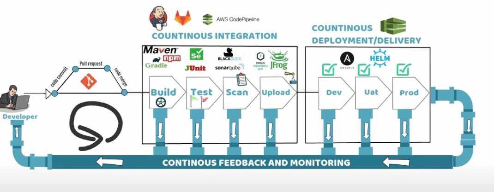
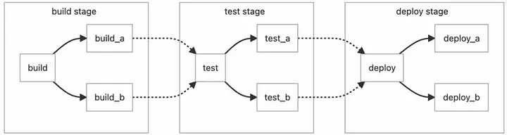
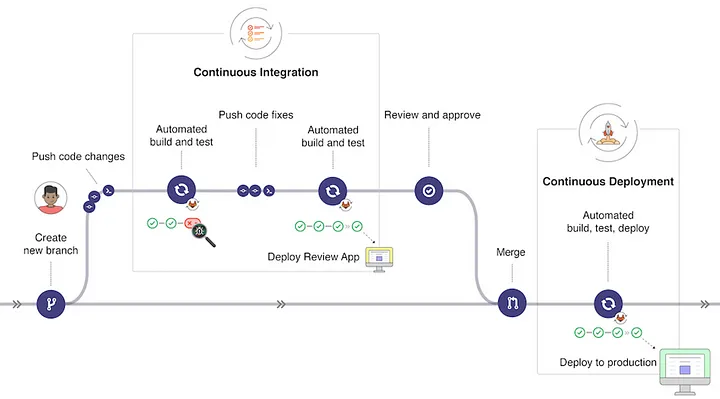

# GitLab-cicd

Developers perform code commit to one of the feature branches -> Pull Request created for the code Merge -> 
Once it is approved **Code is merged to the Deployment Branch**. Which triggers the **BUILD** creation using tools 
like MAVEN, GRADLE, and NPM.
Once the BUILD is created it triggers the **TEST CASES** using tools like Selenium, JUnit, and the test cases get 
uploaded to the required tool. 
Then it triggers a **SECURITY VULNERABILITY CHECK** along with **STATIC CODE ANALYSIS** using tools like BLACK DUCK, 
SONARQUBE.
Then BUILDs get uploaded to the Build repository such as sona type NEXUS, and JFROG Artifact.
This is the **CONTINUOUS INTEGRATION** integrate this together we can use Jenkins, AWS Code Pipeline, and GitLab CI.

As part of the deployment, it triggers the deployment to the **DEV** server. Once Sanity is passed deployment gets triggered 
to the **UAT** server --> Sanity passed  gets triggered to **PROD** server.  This process called **CONTINUOUS DELIVER/DEPLOYMENT**
it can  be done using tools like Ansible, HELM, and AWS Code Pipeline.

CONTINUOUS DEPLOYMENT vs CONTINUOUS DELIVERY
**Continuous Deployment** - need some manual trigger, before the product deployment.
**Continuous Delivery**- automated part of the deployment life cycle.
it is followed by **Continuous Feedback** and **Monitoring** at all stages --> One **RELEASE CYCLE**




**GitLab RUNNER** is an application that runs jobs in a pipeline, and can be installed on the cloud or an on-prem,
can be installed on many different operating systems, and runs on DOCKER and K8S. 
DEVOPS person registers an agent with a token, established a trust relationship between GitLab Instance and communication channel, 
TYPES of RUNNER: 
Private Runner - like the self-hosted agent and can be installed on your own data center or cloud services. 
Shared Runner - uses the runner from the available pool of runners, GitLab based on tags. 
GROUP Runner - can be installed on Kubernetes cluster which supports high availability and fault tolerant. 


I will try to create a Gitlab CI pipeline, using Maven and Docker. I'll, use java application as an artifact.

## Gitlab CI/CD concept.

1. The benefits of using

Use GitLab CI/CD to catch bugs and errors early in the development cycle. GitLab CI/CD  can automatically build, test, deploy, and monitor your applications by using Auto DevOps.

2. Basic concepts

**.gitlab-ci.yaml** : (Configuration file). We configure our pipeline with this file. We must create it in the repository. When we push on a branch of our repo, a pipeline will  be triggered on a dedicated virtual machine running jobs described in **.gitlab-ci.yaml** file.

Pipeline configuration begins with the job. jobs are the most fundamental element of a **.gitlab-ci.yaml**. Jobs picked up by runners, and executed in the environment of the runner, 

```
job1:
  script: "execute-script-for-job1"

job2:
  script: "execute-script-for-job2"
```

Stages: It defines when to run the jobs. For example, after one stage compiles the code, other stages run tests, see Figure 1.



3. GitLab CI/CD Workflow



This workflow shows the major steps in the GitLab process, when we push commits to a feature branch in a remote repo, it triggers the CI/CD pipeline for the project --> runs automated scripts -> builds and tests my application --> previews the changes in a Review App --> Get code reviewed and approved --> Merge the feature branch into the default branch -->  GitLab CI/CD deploys your changes automatically to a production environment. 

4. Create a GitLab Repository

5. Create .gitlab-ci.yml


