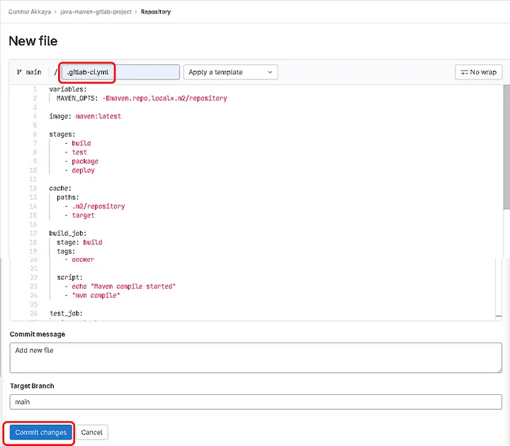

# GitLab-cicd

Developers perform code commit to one of the feature branches -> Pull Request created for the code Merge -> 
Once it is approved **Code is merged to the Deployment Branch**. Which triggers the **BUILD** creation using tools 
like MAVEN, GRADLE, and NPM.
Once the BUILD is created it triggers the **TEST CASES** using tools like Selenium, JUnit, and the test cases get 
uploaded to the required tool. 
Then it triggers a **SECURITY VULNERABILITY CHECK** along with **STATIC CODE ANALYSIS** using tools like BLACK DUCK, 
SONARQUBE.
Then BUILDs get uploaded to the Build repository such as sona type NEXUS, and JFROG Artifact.
This is the **CONTINUOUS INTEGRATION** integrate this together we can use Jenkins, AWS Code Pipeline, and GitLab CI.

As part of the deployment, it triggers the deployment to the **DEV** server. Once Sanity is passed deployment gets triggered 
to the **UAT** server --> Sanity passed  gets triggered to **PROD** server.  This process called **CONTINUOUS DELIVER/DEPLOYMENT**
it can  be done using tools like Ansible, HELM, and AWS Code Pipeline.

CONTINUOUS DEPLOYMENT vs CONTINUOUS DELIVERY
**Continuous Deployment** - need some manual trigger, before the product deployment.
**Continuous Delivery**- automated part of the deployment life cycle.
it is followed by **Continuous Feedback** and **Monitoring** at all stages --> One **RELEASE CYCLE**


**GitLab RUNNER** is an application that runs jobs in a pipeline, and can be installed on the cloud or an on-prem,
can be installed on many different operating systems, and runs on DOCKER and K8S. 
DEVOPS person registers an agent with a token, established a trust relationship between GitLab Instance and communication channel, 
TYPES of RUNNER: 
Private Runner - like the self-hosted agent and can be installed on your own data center or cloud services. 
Shared Runner - uses the runner from the available pool of runners, GitLab based on tags. 
GROUP Runner - can be installed on Kubernetes cluster which supports high availability and fault tolerant. 


I will try to create a Gitlab CI pipeline, using Maven and Docker. I'll, use java application as an artifact.

## Gitlab CI/CD concept.

1. The benefits of using

Use GitLab CI/CD to catch bugs and errors early in the development cycle. GitLab CI/CD  can automatically build, test, deploy, and monitor your applications by using Auto DevOps.

2. Basic concepts

**.gitlab-ci.yaml** : (Configuration file). We configure our pipeline with this file. We must create it in the repository. When we push on a branch of our repo, a pipeline will  be triggered on a dedicated virtual machine running jobs described in **.gitlab-ci.yaml** file.

Pipeline configuration begins with the job. jobs are the most fundamental element of a **.gitlab-ci.yaml**. Jobs picked up by runners, and executed in the environment of the runner, 

```
job1:
  script: "execute-script-for-job1"

job2:
  script: "execute-script-for-job2"
```

Stages: It defines when to run the jobs. For example, after one stage compiles the code, other stages run tests, see Figure 1.


3. GitLab CI/CD Workflow


This workflow shows the major steps in the GitLab process, when we push commits to a feature branch in a remote repo, it triggers the CI/CD pipeline for the project --> runs automated scripts -> builds and tests my application --> previews the changes in a Review App --> Get code reviewed and approved --> Merge the feature branch into the default branch -->  GitLab CI/CD deploys your changes automatically to a production environment. 

4. Create a GitLab Repository

5. Create .gitlab-ci.yml



The content of the .gitlab-ci.yml file:

```
variables:
  MAVEN_OPTS: -Dmaven.repo.local=.m2/repository

image: maven:latest

stages:
    - build
    - test
    - package
    - deploy


cache:
  paths:
    - .m2/repository
    - target

build_job:
  stage: build
  tags:
    - docker 

  script: 
    - echo "Maven compile started"
    - "mvn compile"


test_job:
  stage: test
  tags:
    - docker 

  script: 
    - echo "Maven test started"
    - "mvn test"

package_job:
  stage: package
  tags:
    - docker 

  script: 
    - echo "Maven packaging started"
    - "mvn package"


Deploy_job:
  stage: deploy
  tags:
    - docker 

  script: 
    - echo "Maven deploy started"
```

Explanation of .gitlab-ci.ymlfile:

variables : We will set a variable called MAVEN_OPTS, this will be the local repository which will be “.m2/repository”. Note: The .m2 folder is created by the maven when you run any maven command. By default, the maven local repository is %USER_HOME%/. m2 directory (5).

image maven:latest: We are choosing a docker image for Gitlab runner here. We will use the maven image for this hands-on because this is a Java project and we will use the maven container. Maven is available in the docker image “maven:latest”. latest means the latest approved image of the maven docker image, we will use it. If we don’t choose an image, The default image ruby:2.5 is used by the GitLab runner. Also, if you want to use all the jobs in your pipeline to use the same image, the location of the image should be at the top level as shown above.

stage: The names of our 4 jobs are here.

cache: The path that Maven will copy the files like the .jar file when it runs the commands in “the Build Life cycle”.

### Maven Lifecycle

There are three standard lifecycles provided by Maven.

clean - Intended for clean-up of any prioor build managed outputs and artifacts
default(build) - intended for project build, test and deployment of artifacts
site - intended for project site documentation.

Explanation of Maven’s commands in the .gitlab-ci.ymlfile

build_job: The name of the first job in this case. Prints “Maven compile started” on the screen with the echo command.

The script section in the second line tells the GitLab to compile the code. With themvn compilecommand, Maven takes the source code and converts it to byte-code and creates the target folder, and saves it as a file with a class extension in the target folder.

test_job: With “mvn test” command, Maven runs “unit tests”, and saves outputs in the src/test folder. It is the 15th step of the Default Life cycle.

package_job: With “mvn package” command, Maven creates the jarextension package and saves outputs in the target folder. It is the 17th step of the Default Life cycle.

deploy_job: With “mvn deploy” command, Maven creates the jarextension artifact file, and saves it in the “.m2 folder”. Also, If we set it in “pom.xml” files, it is also saved to a remote artifact repository like Nexus with this command. It is the 23rd step and final step of the Default Life cycle.

4. Creating pom.xml file and explanation of it

Maven first reads the settings file (config file - pom.xml). So we need to create this file before the .gitlab-ci.yml file. Otherwise, when we click on the “commit changes” button in Figure 6, the pipeline will give an error.

It is an XML file that contains information about the project and configuration details used by Maven to build the project. It contains default values for most projects. Examples: the build directory, which is target; the source directory, which is src/main/java; the test source directory, which is src/test/java; and so on. When executing a task or goal, Maven looks for the POM in the current directory. It reads the POM, gets the needed configuration information, then executes the goal. (8).

pom.xmlIt searches the local repository (local cache) for required dependencies;
For Windows in the %homepath%\.m2 folder.
For Linux, in the $HOME/.m2 folder

```
<project xmlns="http://maven.apache.org/POM/4.0.0" xmlns:xsi="http://www.w3.org/2001/XMLSchema-instance"
  xsi:schemaLocation="http://maven.apache.org/POM/4.0.0 http://maven.apache.org/maven-v4_0_0.xsd">
  <modelVersion>4.0.0</modelVersion>
  <groupId>com.mycompany.app</groupId>
  <artifactId>my-app</artifactId>
  <packaging>jar</packaging>
  <version>1.0-SNAPSHOT</version>
  <name>my-app</name>
  <url>http://maven.apache.org</url>
  <dependencies>
    <dependency>
      <groupId>junit</groupId>
      <artifactId>junit</artifactId>
      <version>4.13.2</version>
      <scope>test</scope>
    </dependency>
  </dependencies>
  <properties>
    <project.build.sourceEncoding>UTF-8</project.build.sourceEncoding>
  </properties>
  <build>
    <pluginManagement>
      <plugins>
        <plugin>
          <groupId>org.apache.maven.plugins</groupId>
          <artifactId>maven-compiler-plugin</artifactId>
          <version>3.8.1</version>
          <configuration>
                <source>1.8</source>
                <target>1.8</target>
            </configuration>
        </plugin>
      </plugins>
    </pluginManagement>
    <plugins>
      <plugin>
        <!-- Build an executable JAR -->
        <groupId>org.apache.maven.plugins</groupId>
        <artifactId>maven-jar-plugin</artifactId>
        <version>3.2.0</version>
        <configuration>
          <archive>
            <manifest>
              <addClasspath>true</addClasspath>
              <classpathPrefix>lib/</classpathPrefix>
              <mainClass>com.mycompany.app.App</mainClass>
            </manifest>
          </archive>
        </configuration>
      </plugin>
      <plugin>
        <groupId>org.apache.maven.plugins</groupId>
        <artifactId>maven-enforcer-plugin</artifactId>
        <version>3.0.0-M3</version>
        <executions>
          <execution>
            <id>enforce-maven</id>
            <goals>
              <goal>enforce</goal>
            </goals>
            <configuration>
              <rules>
                <requireMavenVersion>
                  <version>[3.5.4,)</version>
                </requireMavenVersion>
              </rules>
            </configuration>
          </execution>
        </executions>
      </plugin>
    </plugins>
  </build>
</project>
```

<groupId>com.mycompany.app</groupId> : The name of the app.

<artifactId>my-app</artifactId> : The name of the project and folder.

Note: <groupId> + <artifactId> + <version> = “g.a.v.” creates our folder path.

<packaging>jar</packaging> : The extension of artifact will be Jar , when the “mvn package” command runs.

<version>1.0-SNAPSHOT</version> : It sends our Jar file to snapshot repository.

Note : If it is “<version>1.0</version>” , It sends our Jar file to release repository. Also, we use this “<version>” in a 3rd party repository like Nexus.

<dependency>
<groupId>junit</groupId> : It will use JUnit to test java codes.

<plugins> : Plugins that need to be downloaded for Maven to work are specified here


